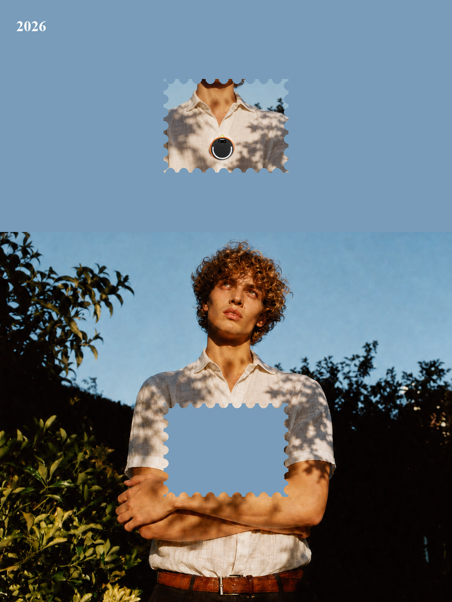

# UBL 单页网页设计对话总结

## 当前项目

- 工作目录：`/Users/mac/Desktop/前端网页设计/第一页设计`
- 当前页面入口：`index.html`
- 当前样式文件：`style.css`
- 页面语言：英文
- 品牌名称：UBL
- 页面类型：单页 Hero Landing Page

## 用户最终目标

用户希望基于提供的截图，制作一个高级、和谐、具有编辑感的 UBL 首页首屏：

- 使用素材文件夹中的 `主图背景.png` 作为主视觉。
- 不修改主图内容，不做滤镜、重绘或替换。
- 参考截图中的中央竖向构图、雾蓝色画面和人物邮票元素。
- 左右区域使用由中央雾蓝向外缘暖白过渡的渐变。
- 页面需要有 Header。
- 主标题为：`Earn from the life you are already living.`
- 主图胸前蓝色留白区域放置 `start earning`。
- 最终要求主图横向铺满网页，减少两侧留白。

## 主要迭代记录

### 第一版

- 创建了完整的 UBL 英文落地页。
- 加入产品理念、使用流程、隐私、FAQ、候补名单等多个区块。
- 使用了 LUMA 品牌名，后来根据用户反馈改为 UBL。

### 第二版

- 全站改为英文。
- 使用标题：`Earn from the life you're already living.`
- 增加 `Start earning` CTA。
- 改用 UBL Logo。
- 使用素材文件夹中的人物图和主图背景。

### 第三版

- 删除后续区块，只保留单页首屏。
- 使用 `草莓金发男生-EgoClip-向上看.png`，后来根据用户最新要求改回 `主图背景.png`。
- 去掉多余年份，只保留图片内的 2026。
- CTA 改为无背景、无边框的深绿色文字。
- 标题加粗，并将 `you are already living` 放大突出。

### 第四版

- 参考 GitHub 上的网页设计 Skill：
  - Anthropic `frontend-design`
  - `ui-design-skill`
- 应用了以下设计原则：
  - 单一视觉焦点。
  - 语义化、克制的色彩系统。
  - 使用深蓝文字和森林绿 CTA。
  - 删除不必要的白色卡片和装饰。
  - 增加响应式布局和轻量入场动效。

### 当前版本

- 主图已切换为 `素材/主图背景.png`。
- 主图宽度设置为 `100vw`，用于铺满网页宽度。
- Header 已加入：
  - UBL Logo
  - How it works
  - Why it matters
  - FAQ
  - Join waitlist
- 主标题覆盖在主图中央区域，使用白色粗体。
- `start earning` 位于人物胸前蓝色留白区域。
- 页面背景使用雾蓝色，配合暖白到雾蓝的两侧渐变方向。

## 当前文件结构

```text
第一页设计/
├── index.html
├── style.css
└── 素材/
    ├── 主图背景.png
    ├── 草莓金发男生-EgoClip-向上看.png
    ├── 草莓金发男生-EgoClip-直视镜头.png
    └── luma-hero-editorial.png
```

## 当前主图约束

主图文件：

`/Users/mac/Desktop/前端网页设计/第一页设计/素材/主图背景.png`

当前页面引用方式：

```html

```

原图尺寸记录：`1086 × 1448`。

## 当前页面结构

- Header：UBL Logo、导航、Join waitlist。
- Hero：完整主图、2026、主标题、胸前 `start earning`。
- 没有额外内容区块，也没有额外 JavaScript 文件。

## 已验证内容

- 桌面端页面可以正常加载。
- 移动端页面可以正常加载。
- 主图路径正确，图片可加载。
- CTA 可点击并指向 UBL 邮件地址。
- 页面主标题没有使用缩写 `you're`，使用完整形式 `you are`。

## 后续可继续优化的方向

- 根据最终浏览器尺寸微调主图的纵向裁切位置。
- 如果需要严格复刻某个固定尺寸截图，可以针对该尺寸单独设置 `aspect-ratio` 和 `object-position`。
- 如果导航需要真实功能，可以进一步增加对应内容区块或改成锚点滚动。
